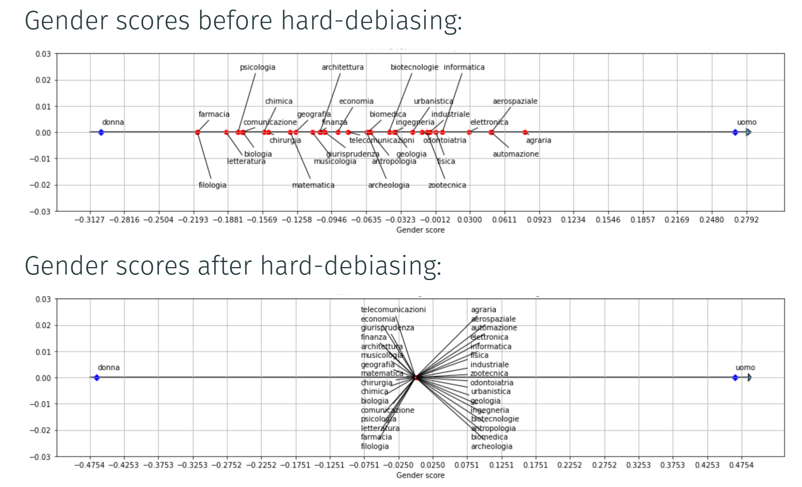
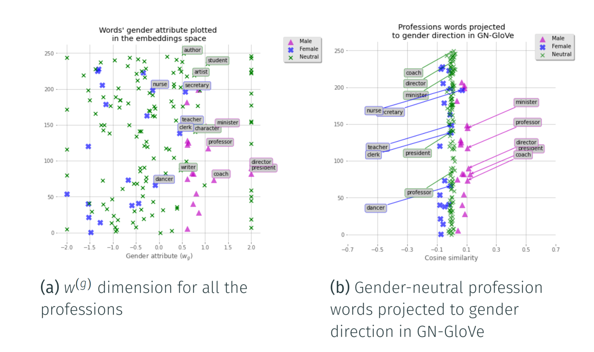

# :male_sign: Gender discrimination in Natural Language Processing :female_sign:

This repository contains a project realized as part of the *Ethics in Artificial Intelligence* course of the [Master's degree in Artificial Intelligence](https://corsi.unibo.it/2cycle/artificial-intelligence), University of Bologna.

## Description

The aim of this project is to develop a **proof of concept** about how to address the gender discrimination in NLP.
Two approaches have been investigated:
* Hard-Debiasing on pre-trained Italian Word Embeddings
* GN-GloVe which reduce the bias during the training of word embedidngs

In order to have a deeper understanding of the problem, take a look at the [presentation](./presentation.pdf) of the project.

## Repository structure

    .
    ├── data                             # Contains the files of words used for the experiments
    ├── debiaswe                         # Contains debiasing functions 
    │   ├── co_occurrence.py             # Functions to compute the co-occurence matrix for GN-Glove
    │   ├── data.py                      # Functions to load data files
    │   ├── debias_glove.py              # Actual implementation of GN-Glove debiasing
    │   ├── metrics.py                   # Functions to compute metrics for the experiments 
    │   └── we.py                        # Auxiliar functions to load and manage word embeddings
    ├── embeddings                       # Contains the word embeddings file for the hard-debiasing approach
    ├── scripts                          # Contains the scripts to convert the original twitter word embeddings to a tsv file and fileter 
    ├── gn-glove_we_visualization.ipynb  # Visualization of the word embeddings generated by GN-Glove
    ├── hard_debias_italian_we.ipynb     # Visualization of the word embeddings generated by Hard-Debiasing                        
    ├── presentation.pdf                 # Slides about the project
    ├── LICENSE
    └── README.md

## Results
The results of both approaches are presented below:
- *Hard-Debiasing*:
    

- *GN-GloVe*:
    

## Versioning

We use Git for versioning.

## Group members

|   Name   | Surname |               Email               |                       Username                        |
| :------: | :-----: | :-------------------------------: | :---------------------------------------------------: |
| Davide   | Angelani| `davide.angelani@studio.unibo.it` | [_qnozo_](https://github.com/qnozo) |
|  Eric  | Rossetto | `eric.rossetto@studio.unibo.it`  |        [_Erhtric_](https://github.com/Erhtric)        |
| Giuseppe |  Murro  | `giuseppe.murro@studio.unibo.it`  |         [_gmurro_](https://github.com/gmurro)         |
| Salvatore |  Pisciotta  | `salvatore.pisciotta@studio.unibo.it`  |         [_SalvoPisciotta_](https://github.com/SalvoPisciotta)         |
| Xiaowei |  Wen  | `xiaowei.wen@studio.unibo.it`  |         [_WenXiaowei_](https://github.com/WenXiaowei)         |

## License

This project is licensed under the MIT License - see the [LICENSE](./LICENSE) file for details
